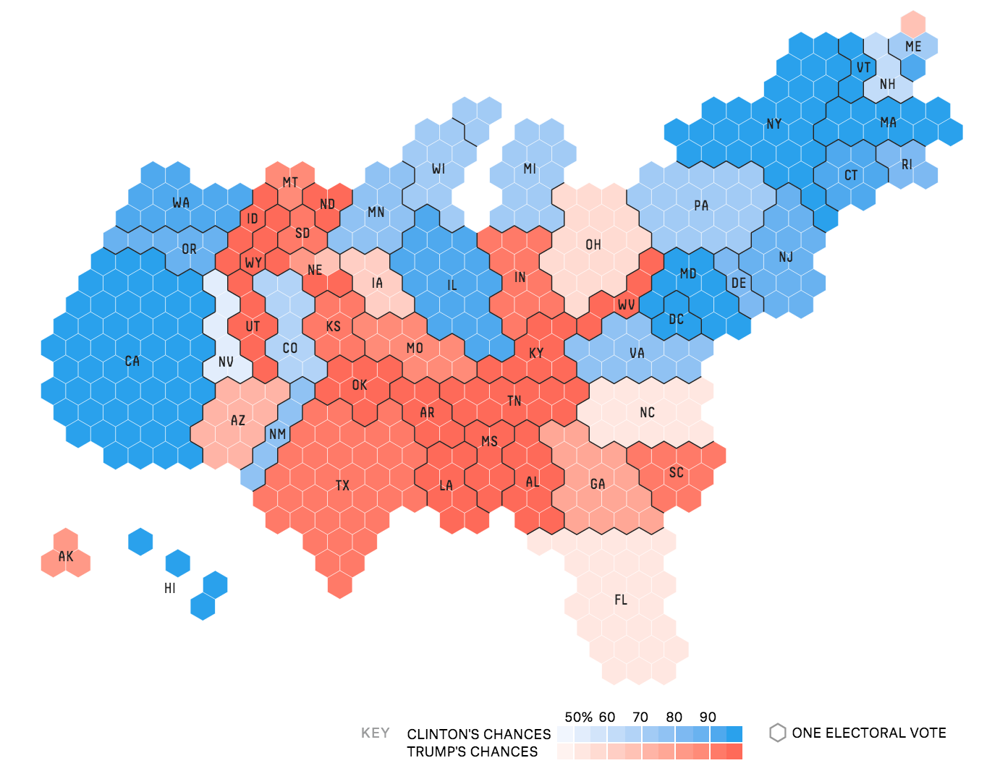

#### GISC 425 T1 2020
# The 'big' assignment: ideas and scope
## A list of topic ideas
Here are some topic ideas to consider and discuss. To begin, don't worry too much about *how* think more about how much you are interested (or not) in each one. Alternatively think up an [idea of your own](#your-idea-here)) to work on.

### Isochrones
Have a look at [this website](https://mapnificent.net), which enables you to generate public transport isochrones for a chosen location in many major cities (including Wellington, although I don't know if it has tried using the buses lately...).  You could also read [my masters dissertation](http://southosullivan.com/msc/mastersThesis.pdf) or [this paper](https://dx.doi.org/10.1080/136588100240976) I wrote based on it.

An isochrone map shows lines of equal travel time from an origin location, based on a specified form of transport. In some respects transit isochrone maps are more interesting than car or bike or walking ones.

### Multitype Voronoi
We have encountered Voronoi (or Thiessen or Dirichlet or proximity) polygons a number of times. Generally they are associated with a set of points. Christopher Gold has proposed that Voronoi regions be associated not only with points, but with lines and polygons, and that these form natural neighbourhood areas of the points, lines and polygons. Below is a simple example.  An early paper about this is [here](http://link.springer.com/10.1007/3-540-55966-3_13).

### Gerrymandering and/or the US electoral college
It's always US election season. Recent US electoral traumas have brought the issue of gerrymandering to increased public attention. There are various spatial dimensions to the issue and this project would involve exploring the issue by writing code that could generate alternative redistricting maps. For inspiration take a look at [Random States of America](http://fakeisthenewreal.org/random-states-of-america/) and [Redraw the States](http://kevinhayeswilson.com/redraw/).

### (Related) block groups for New Zealand
Apart from various more recent ills in the 2018 census, New Zealand's census of population is odd in lacking a level between meshblocks (80-100 people) and area units (3-5,000 people). For example the US census has blocks (like meshblocks) and tracts (like area units), but also has an intervening level of aggregation of blocks into block groups (about 500 people). These enable provision of more detailed information at greater resolution without compromising privacy.

An example of work in this area is by Dan Exeter and collaborators and University of Auckland. Take a [look](https://www.fmhs.auckland.ac.nz/en/soph/about/our-departments/epidemiology-and-biostatistics/research/hgd/research-themes/imd.html).

### Cartograms
Cartograms are maps where areas are changed to represent something other than area on earth surface. A common example is for presenting election results. For example, see this discussion

https://onlinejournalismblog.com/2016/06/28/cartogram-or-election-map-the-guardian-vs-the-new-york-times/

of the pros and cons. Here's an example from fivethirtyeight.com

Note that cartograms don't have to use hexagons, although many do.

### Visibility graphs
Visibility graphs are networks where nodes represent locations or objects, and edges exist between the nodes if they are mutually visible. I did some early work on this [years ago](https://www.tandfonline.com/doi/pdf/10.1080/13658810151072859?needAccess=true) (sensing a theme here?).

### Your idea here
Something completely different!

## Scope and logistics
### Deliverable
You have the whole second half of trimester to work on this. The expectation in terms of a deliverable item is one (or more) of the following:

+ a Jupyter notebook or set of notebooks that explore ideas, explain code, and implement aspects of the selected topic; or
+ extension to ArcGIS or plugin for QGIS that implement the analysis method associated with your topic; or
+ standalone python script that can apply the analysis method associated with your topic.

Alternative formats of submitted work are potentially allowable by agreement with me (arrange a meeting to discuss).

Any submitted work *must* be thoroughly commented (this is important) either in the code, or if you submit notebooks, in the markdown cells in the notebook.

### Alone or in a pair
You can work alone, or in a pair. There is a lot to be said for [pair programming](https://en.wikipedia.org/wiki/Pair_programming) so whatever reservations you might have about group work, you should strongly consider this option.

### Topic selection
We'll see how it goes on this, but my strong preference is that every project be different. I can consider two people or pairs working on the same topic, but would prefer that this not be the case.

### Tools etc.
We will spend a lot of time in class in the second half of semester on the tools and approaches you need to make this work. What we cover will depend on problems and challenges faced by groups as they arise.
